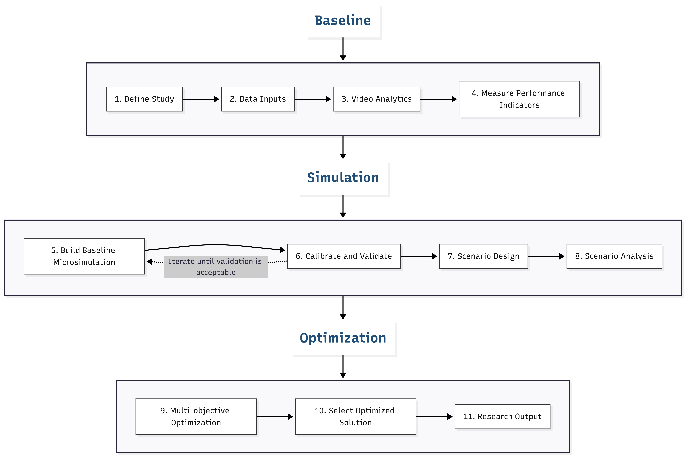

# Meeting Document

| Item | Content |
|------|---------|
| Name |  HUSSEIN MD TANVEER|
| Meeting Date | YYYY/MM/DD |
| Previous Meeting Date | YYYY/MM/DD |
---

## 1. What I Want to Discuss Today (Most Important)

1. Decide on selection of candidate urban highway section/s 
2. Decide on pre study trip in Bangladesh

## 2. Current Situation (Progress Since Last Meeting)
This is the first individual meeting.
Here is the Proposed methodology flow

### What I did

- Prepare preliminary scripts for analyzing video data. Now, it can detect, count and classify vehicles, detect the trajectory to calculate TTC

### What I could not do / What is delayed

- Could not decide on the section of highway that can be chosen.
- One major issue is that BRT operation has not yet commenced, and there appears to be limited possibility of its immediate launch, as the government is reportedly considering cancelling the BRT operation. Even if a decision is made to begin operations, implementation may not be possible immediately because the buses have not yet been procured and some stations are not ready for service. At present, the government is considering the possibility of using the BRT lane as a toll road, although the operational modality has not yet been finalized. Meanwhile, the lanes are already being used informally, but without any clearly defined segregation of vehicles. 
1: https://en.prothomalo.com/bangladesh/upbhxs6byq

## 3. Definitions of Terms

<!-- Define the key terms used in this document here. -->
<!-- Be especially explicit about terms you define yourself or terms that can be ambiguous. -->

| Term | Definition |
|------|------------|
|  |  |
|  |  |

## 4. My Own Thoughts
### Decide on selection of candidate urban highway section/s

A straight section within two BRT stations which are at grade can be chosen, the length will be nearly 500m to less than 1000m. This section should preferably have a footover bridge which can be used for mounting camera for video recording. The place has to be chosen after physical visit. 

Although the BRT operation is highly unlikely to commence in immediate future, all the lanes are functional. The present chaotic nature of the traffic condition still makes it am interesting case for evaluation.

### Decide on pre study trip in Bangladesh
I believe a preliminary study is necessary to obtain initial information for assessing data availability, site suitability, and the data acquisition process. Visits to relevant agencies, including the Roads and Highways Department, Dhaka BRT, the Road Transport and Highways Division, and the Dhaka Transport Coordination Authority, as well as potential candidate highway sections, will help me evaluate the quality and accessibility of available data. This will provide a clearer basis for further refining and consolidating my research plan.

## 5. Where I Am Stuck / What I Cannot Decide on My Own

- Alternatively, I can select another urban highway with similar condition, however it will not be the same. There will not be enough lanes for simulating alternative lane configurations

-
## 6. Things I Want to Confirm

<!-- If there are simple questions or confirmations (not discussions), list them here. -->

- 
- 

## 7. Computational Results / Figures (links to code required)

<!-- When you include calculation or analysis results, strictly follow these rules: -->
<!-- - Upload the generating code to GitHub -->
<!-- - Provide a link to the specific script / commit / notebook -->
<!-- - Make the data source, preprocessing, and parameter settings clear -->

| Result | Link to Code | Notes |
|--------|--------------|-------|
| Fig. 1 |  |  |
| Table 1 |  |  |

## 8. Supplementary Materials

<!-- Add links to references, related materials, and past discussion notes as needed. -->

- 
- 

---

## Action Items for Next Meeting (fill in after the meeting)

<!-- Note these during or right after the meeting so they can be matched against "What I did" in the next document. -->

- [ ] 
- [ ] 
- [ ] 
